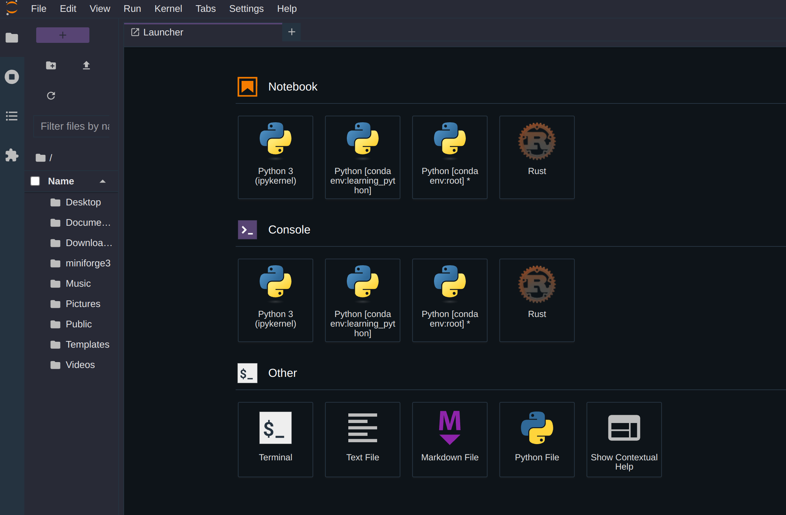
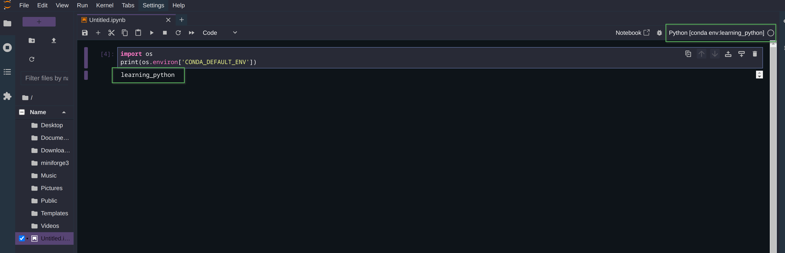
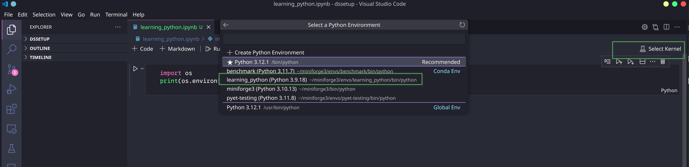
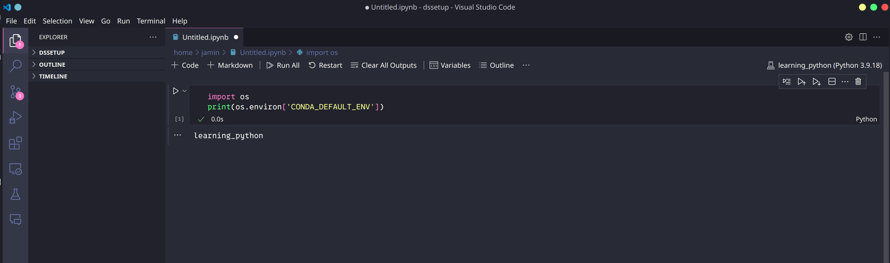
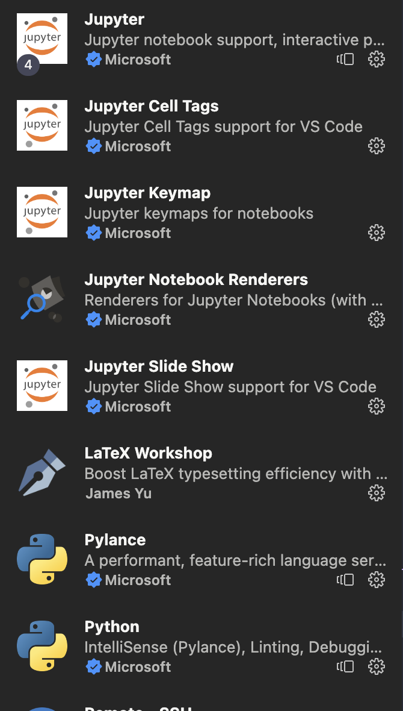

# Scientific Python Setup

## Table of Contents
- [Introduction](#introduction)
- [Python Installation](#python-installation)
    - [Post Installation](#post-installation)
    - [Jupyter Notebooks](#jupyter-notebooks)
    - [A note on Apple Silicon](#a-note-on-apple-silicon)
- [Git installation](#git-installation)
- [Visual studio code installation](#visual-studio-code)
    - [Extensions](#extensions)
- [Useful tools](#useful-tools)
    - [Obsidian](#obsidian)
    - [IT-Tools](#it-tools)
    - [WSL](#windows-subsystem-for-linux-wsl)
    - [LaTeX for VScode](#latex-for-visual-studio-code)


# Introduction
My *opinionated* recommendations on a minimal setup for data science / scientific Python. This is by no means an exhaustive list or guide. Just a basic overview of the tools I wish I had started with and how to install and configure them where appropriate. 

A quick note, for those of you who go down the Windows subsystem for Linux route, python and git should be installed using the Linux methods within the WSL terminal. 
# Python Installation
Historically I would have recommended a complete install of Anconda to manage both your Python installation alongside its provision of Spyder as an IDE. Countless bugs (Namely in Spyder) have prevented me from using it consistently over recent years so I can no longer recommend using it. Instead, I recommend installing miniforge to manage your Python installation and an IDE such as VScode/Codium or Lapce if a more lightweight IDE is needed.

Miniforge is a cross-platform community-maintained version of Conda and is part of the wider conda-forge ecosystem. A more detailed overview of Conda, Anaconda, conda-forge and mini-forge can be found here [here](https://conda-forge.org/docs/index.html). 

The main benefit beyond the default use of the conda-forge channel for more and more up-to-date packages is it does not install lots of unneeded packages leading to a small installation size. 

Beyond the basics provided here, there are ample instructions and FAQ provided in the official documentation: [https://github.com/conda-forge/miniforge](https://github.com/conda-forge/miniforge)

## Linux 
On Linux, the installation is as simple as pasting this command into the command line and following the prompts. I highly recommend adding Python to your path when you are prompted. This minimizes the chances you accidentally update/change the native Python your system uses. 

```
curl -L -O "https://github.com/conda-forge/miniforge/releases/latest/download/Miniforge3-$(uname)-$(uname -m).sh"
bash Miniforge3-$(uname)-$(uname -m).sh
```
## MacOS
For MacOS, you can either use the above commands that were used for Linux, or if you are using Brew as your package manager (I strongly recommend) then you can simply:
```
brew install miniforge
```
## Windows
For Windows, the latest installers can be found [here](https://conda-forge.org/miniforge/). Find the installer named `Miniforge3` and download the executable for Windows. It will have a naming convention as such `Miniforge3-23.3.1-1-Windows-x86_64.exe`

Again it is worth adding Python to your path (there is an unchecked checkbox during the GUI installation; I would tick it)
## Post-installation
It is worth briefly discussing _best_ practices for Python environment management in case you are not familiar with it. Environment management ensures the reproducibility and reliability of your Python code. Let's come up with some hypothetical examples. Let's say we wrote a script in 2015 that uses a 2015 version of Numpy (A Python linear algebra library) to perform some matrix multiplication. This will have some methods that you invoke. Let's now say, you start a new project in 2018 that is also going to perform some matrix multiplication, but you decide it's been a while so you choose to update your entire base conda environment. You do this and start your new project. However, you now get an error saying this matrix multiplication method is no longer viable and has been deprecated and replaced by this *better* method. Not a problem, you use this new method on your new project. However, the problem arises when you return to your old project, and it no longer works and requires fixing. 

This simplified example is what virtual environments aim to solve (and others). 
We can create a virtual environment with Conda simply by specifying an environment name and Python version.

```
conda create --name 'name of your env' python=3.11
```
We can then activate this environment using `conda activate 'name of your `env'`. When this environment is active, its name is displayed in the command line. 
```
(name of your env) user@desktop > 
```
From here you can install your required packages and their desired version for your current project. This also allows you to create a list of your dependencies for your project if you want to replicate it on another device or share it with someone else in the form of a Python package. 

A helpful guide to Conda and virtual environments can be found on this [cheat sheet](https://docs.conda.io/projects/conda/en/4.6.0/_downloads/52a95608c49671267e40c689e0bc00ca/conda-cheatsheet.pdf).

## Installing Packages

Within your chosen virtual environment, it is relatively easy to install packages to your environment with either `Conda` or `Pip`

Each package will probably have a recommended way to do it (I would follow that!)

For example, we can install `Matplotlib` with conda 

```
conda install matplotlib
```
or with pip:

```
pip install matplotlib
```

However, I have found some packages; for example, the Materials project (`pymatgen`) recommends installing `Matplotlib` and `Numpy` via `Conda` instead of through pip. 
## Jupyter Notebooks

The following advice works for a `Jupyter Notebook`, `Jupyter Lab`, and Notebooks in `VScode`. As discussed, virtual environments simplify handling different versions of `Python` and any associated libraries. We need to take additional steps to enable virtual environments in our notebooks. There is no one way to do this; this is how I do it. 

Firstly, we need to install `Jupyter` in our base conda environment. For this, we will use `conda` rather than `pip`.
Given we are using `Miniforge`, our conda channel is by default conda-forge, so we can simply use:

```bash
conda install jupyter
```
You can now start a notebook or lab session as you usually would by running 
```
jupyter notebook
```

You will find this only gives you the option to select a single `Python` kernel, not ideal. We need to enable the ability to select other kernels. Firstly, still in our base environment, we need to install `nb_conda_kernels`. 


```
conda install nb_conda_kernels
```

Then, we can activate our virtual environment and install the `ipykernel`.

```
conda activate ('name of your env')


conda install ipykernel
```

Now, when we start our notebook or lab session, we should be able to select our kernel like so:

<div align="center">
    
</div>

As you can see, we now have far more options, including our virtual environment. You can also install non-Python languages like I have with the `Rust` REPL kernel.

We can quickly sanity-check that our virtual environment is working by creating a temporary notebook. You can see in the following picture that it is indeed using the virtual environment. 

<div align="center">
    
</div>


For VScode users, once the correct [extensions](#visual-studio-code) are installed, there is a similar process for selecting your virtual environment. 

<div align="center">
    
</div>


<div style="height: 50px;"></div> 

<div align="center">
    
</div>


## A note on Apple Silicon 

As Apple Silicon Macs (M1, M2, etc) use ARM-based SOC, many `Python` packages can out of the box run as efficiently as they could, or if they are only built for x86 (Intel, AMD) architecture might not work at all. This is the secondary bonus of using `Miniforge`. The conda-forge channel provides prebuilt binaries for Apple-AArch64, allowing for a seamless migration between Windows, Mac, and Linux (though pip does have good Apple Silicon support now, too).

In some cases, some libraries can actually take advantage of the memory bandwidth and GPU having direct access to system memory (think self hosting of LLMs), but for our scientific use case: Numpy. Numpy, by default, is built against OpenBLAS, an open linear algebra library. This is great for versatility between operating systems but not so much for taking advantage of bespoke hardware. We can improve the performance of Numpy on Apple Silicon by utilising Apples Accelerate library (a proprietary BLAS library that takes advantage of the achetecture of the chip).
Thankfully, this is relatively trivial to do. Once we have created our `Python` virtual environment, we can simply install Numpy with the following:
```
conda install numpy "libblas=*=*accelerate"
```
Thats all! For me, this gave me a ~x10 performance boost for matrix decomposition. Well worth it for a few extra characters! **Note**: A similar performance boost can be achieved for Windows and Linux users on Intel chips by building Numpy against their `MKL` BLAS libraries:
```
conda install numpy "libblas=*=*mkl"
```


# Git Installation
## Linux
If your Linux distribution does not come with git pre-installed, you will need to download it from your distribution package manager. Here is an example of a Debian-based distribution such as Ubuntu, Pop!_OS, etc.
Note, that this also applies to those using Windows Subsystem for Linux.
## MacOS
MacOS comes with git built in. However, you can install a more up-to-date version using homebrew if you need. I have not yet found I need to do this. 
## Windows
For Windows installations, just install [Git for Windows](https://git-scm.com/download/win) and follow the instructions in the GUI. There are command line installation options as well for those inclined.

## Post-installation

#### Git configuration:
```
git config --global user.name "Foo Bar"
git config --global user.email "foobar@anemail.com"
```
#### SSH keys:
It is worth generating ssh keys for your system and pairing them with a GitHub account. This lets you sync your local git and your remote GitHub repository seamlessly and securely. 

The best way to do this is to follow the official GitHub guide found [here](https://docs.github.com/en/authentication/connecting-to-github-with-ssh/generating-a-new-ssh-key-and-adding-it-to-the-ssh-agent)

I will add a more complete git + github guide in the future.

# Visual Studio Code 
Visual Studio Code is my recommended editor for beginners instead of my previously recommended editor Spyder, due to its recent breaking bugs. 
Its installation is pretty straightforward on all systems. 

## Linux
On Debian (Ubuntu) systems, the following commands will add VScode to the package repository. **Note!** If you are using [WSL](#windows-subsystem-for-linux-wsl) you should install VScode with Windows.
```
sudo apt-get install wget gpg
wget -qO- https://packages.microsoft.com/keys/microsoft.asc | gpg --dearmor > packages.microsoft.gpg
sudo install -D -o root -g root -m 644 packages.microsoft.gpg /etc/apt/keyrings/packages.microsoft.gpg
sudo sh -c 'echo "deb [arch=amd64,arm64,armhf signed-by=/etc/apt/keyrings/packages.microsoft.gpg] https://packages.microsoft.com/repos/code stable main" > /etc/apt/sources.list.d/vscode.list'
rm -f packages.microsoft.gpg
```
followed by:
```
sudo apt install apt-transport-https
sudo apt update
sudo apt install code 

```
## MacOS
For MacOS, I recommend installing VScode with brew
```
brew install --cask visual-studio-code
```
## Windows
For Windows, you can use the installer from the website: https://code.visualstudio.com/download

## Post install

### Github account
It is worth signing in with your GitHub account for settings sync across multiple devices as well as making it relatively easy to use its Git integration to maintain version control of your projects without using the command line version of Git. 
### Extensions
It is worth installing extensions for both pure `Python` and  `Jupyter`.
Navigate to the extensions panel in VScode and search for `Python`. You will see a package provided by Microsoft; install it. It contains all the relevant syntax highlighting and code completion. Secondly, search `Jupyter` and install its extension provided by Microsoft. This may install a collection of extensions. For example, here are the ones I have installed

<div align="center">
    
</div>

Note, the [LaTeX]() extension. Details can be found in the [useful tools](#useful-tools) section of this document. 

It is also worth installing a colour theme that you like; you will be looking at a screen for an extended period of time. My personal choice is the [Dracula Theme](https://draculatheme.com/)
# Useful Tools
A collection of useful tools I have found helpful over the years that I currently still use/recommend. 

## Obsidian 
Obsidian is an excellent free markdown editor with numerous additional features for linking notes. It has great community plugins for drawing etc. Its only downside is if you are an iOS user and you want to sync notes to your phone, you will need to pay for its syncing service. This aside, it is a powerful note-taking tool that stores your notes locally in plain text (markdown format), ensuring the longevity of your knowledgebase regardless of whether you stick with obsidian or not long term. It also has an amazing drawing plugin called excalidraw for drawing technical documents in a clean `.svg` form
Homepage: https://obsidian.md/

## Excalidraw
Even though there is an excellent extension for this in Obsidian, it's well worth checking this out for quick technical drawings. 
Excalidraw: https://excalidraw.com/
## IT-Tools
IT-Tools is a useful website that has quite a few tools that you may find useful. For example, `TOML` to `JSON` file conversion, date time conversion and case conversion. 
Website: https://it-tools.tech/
This can also be self-hosted.
## Windows Subsystem for Linux (WSL)

For those of you using Windows, I highly recommend installing WSL. 
WSL gives you a Linux terminal environment (it is a complete Linux experience); when coupled with Visual Studio code, you get your usual graphical editor, file explorer etc but it allows you to dip your toes into the Linux ecosystem. It also grants you access to the Linux terminal, where you will find many software/python/data science guides that will expect some terminal commands to set certain things up. It is built into windows and is blazingly fast. Much easier than dual-booting Ubuntu. This is something I highly recommend. I highly recommend following this guide after installing Visual Studio code for a hybrid Windows-Linux development environment. 

Guide: https://learn.microsoft.com/en-us/windows/wsl/install


## LaTeX for Visual Studio Code
A simple extension that allows you to edit, compile, and view side-by-side your LaTeX documents, similar to Overleaf. This is a nice local alternative to overleaf and allows for more easily piping your figures, etc, from your Python analysis into your LaTeX document. It can be found in the VScode extensions. 
You will need to install LaTeX on your system as well. For macOS users, I recommend MacTex; for Windows, try TexLive and Linux - it will likely be provided by your package manager e.g., apt on Debian-based systems. Spell checkers such as the Grammarly extension can also be added to help with writing. 
